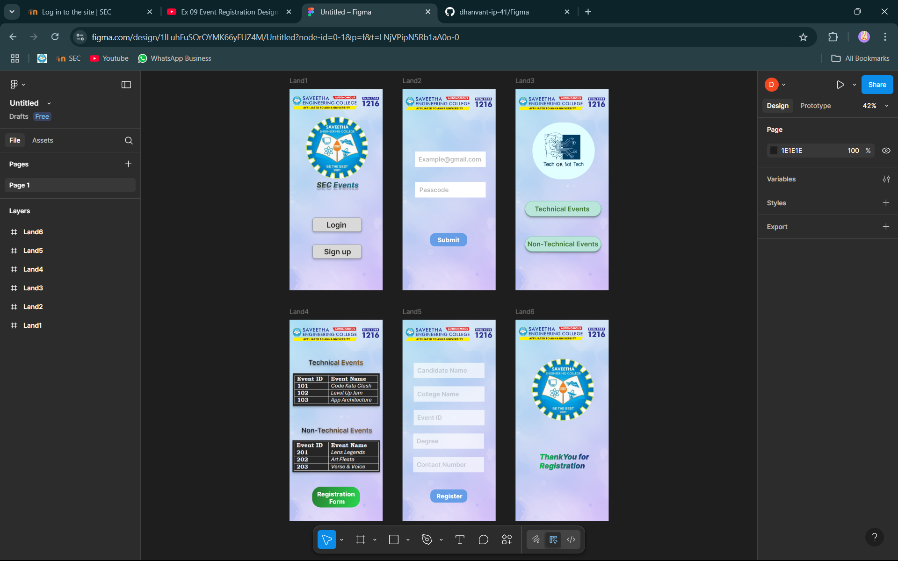

# Ex09 Event Registration Web Application
## Date:

## AIM:
To design, develop and deploy a web application for event registration.

## DESIGN STEPS:

### Step 1:
Create a new frame.

### Step 2:
Select any one preset size of your choice.

### Step 3:
Select the shapes you need.

### Step 4:
Import images as needed.

### Step 5:
Create pages based on your need and link them.

### Step 6:

Validate the HTML and CSS code.

### Step 6:

Publish the website in the given URL.

## DESIGN TOOL:
Figma

## CODE:
Developed By: Dhanvant Kumar V                                                                                               
Reg No: 212224040070

### PAGE 1
#### HTML
```html
<div class="land1">
  <div class="rectangle-1"></div>
  <div class="login"><span class="login_span">Login</span></div>
  <div class="rectangle-1_01"></div>
  <div class="sign-up"><span class="signup_span">Sign up</span></div>
  
  
  <div class="sec-events"><span class="secevents_span">SEC Events</span></div>
</div>
```
#### CSS
```css
.rectangle-1 {
  width: 197px;
  height: 57px;
  left: 93px;
  top: 519px;
  position: absolute;
  background: #D9D9D9;
  box-shadow: 0px 1px 3px rgba(0, 0, 0, 0.30);
  border-radius: 10px;
  border: 1px #8E9394 solid;
}

.login_span {
  color: #2B2A27;
  font-size: 30px;
  font-family: Inter;
  font-weight: 600;
  word-wrap: break-word;
}

.login {
  width: 94px;
  height: 36px;
  left: 149px;
  top: 530px;
  position: absolute;
}

.rectangle-1_01 {
  width: 197px;
  height: 57px;
  left: 93px;
  top: 627px;
  position: absolute;
  background: #D9D9D9;
  box-shadow: 0px 1px 3px rgba(0, 0, 0, 0.30);
  border-radius: 10px;
  border: 1px #8E9394 solid;
}

.signup_span {
  color: #2B2A27;
  font-size: 30px;
  font-family: Inter;
  font-weight: 600;
  word-wrap: break-word;
}

.sign-up {
  width: 168px;
  height: 36px;
  left: 139px;
  top: 638px;
  position: absolute;
}

.image-1 {
  width: 249px;
  height: 249px;
  left: 67px;
  top: 112px;
  position: absolute;
  border-radius: 124.50px;
}

.logo1-1 {
  width: 375px;
  height: 76px;
  left: 0px;
  top: 16px;
  position: absolute;
}

.secevents_span {
  color: #38463A;
  font-size: 30px;
  font-family: Inter;
  font-style: italic;
  font-weight: 800;
  word-wrap: break-word;
  text-shadow: 0px 10px 4px rgba(0, 0, 0, 0.25);
}

.sec-events {
  width: 184px;
  height: 76px;
  left: 109px;
  top: 368px;
  position: absolute;
}

.land1 {
  width: 375px;
  height: 812px;
  position: relative;
  overflow: hidden;
  background-image: url(https://placehold.co/375x812);
}
```

### PAGE 2
#### HTML
```html
<div class="land2">
  
  <div class="rectangle-2"></div>
  <div class="examplegmailcom"><span class="examplegmailcom_span">Example@gmail.com</span></div>
  <div class="rectangle-3"></div>
  <div class="passcode"><span class="passcode_span">Passcode</span></div>
  <div class="rounded-rectangle"></div>
  <div class="submit"><span class="submit_span">Submit</span></div>
</div>
```
#### CSS
```css
.logo1-1 {
  width: 375px;
  height: 76px;
  left: 0px;
  top: 19px;
  position: absolute;
}

.rectangle-2 {
  width: 285px;
  height: 62px;
  left: 50px;
  top: 252px;
  position: absolute;
  background: white;
}

.examplegmailcom_span {
  color: rgba(0, 0, 0, 0.28);
  font-size: 25px;
  font-family: Inter;
  font-weight: 600;
  word-wrap: break-word;
}

.examplegmailcom {
  left: 64px;
  top: 268px;
  position: absolute;
}

.rectangle-3 {
  width: 285px;
  height: 63px;
  left: 50px;
  top: 374px;
  position: absolute;
  background: white;
}

.passcode_span {
  color: rgba(0, 0, 0, 0.28);
  font-size: 25px;
  font-family: Inter;
  font-weight: 600;
  word-wrap: break-word;
}

.passcode {
  left: 68px;
  top: 391px;
  position: absolute;
}

.rounded-rectangle {
  width: 149px;
  height: 53px;
  left: 111px;
  top: 582px;
  position: absolute;
  background: #659DE6;
  border-radius: 20px;
}

.submit_span {
  color: #FFFEFE;
  font-size: 25px;
  font-family: Inter;
  font-weight: 800;
  word-wrap: break-word;
}

.submit {
  left: 141px;
  top: 594px;
  position: absolute;
}

.land2 {
  width: 375px;
  height: 812px;
  position: relative;
  overflow: hidden;
  background-image: url(https://placehold.co/375x812);
}
```

### PAGE 3
#### HTML
```html
<div class="land3">
  
  <div class="rectangle-2"></div>
  <div class="technical-events"><span class="technicalevents_span">Technical Events</span></div>
  <div class="frame-5">
    <div class="non-technical-events"><span class="non-technicalevents_span">Non-Technical Events</span></div>
  </div>
  
</div>
```
#### CSS
```css
.logo1-1 {
  width: 375px;
  height: 76px;
  left: 0px;
  top: 19px;
  position: absolute;
}

.rectangle-2 {
  width: 306px;
  height: 62px;
  left: 38px;
  top: 452px;
  position: absolute;
  background: #B9E5DB;
  border-radius: 30px;
  border: 1px #5DC785 solid;
}

.technicalevents_span {
  color: rgba(30.71, 90.72, 6.98, 0.80);
  font-size: 27px;
  font-family: Inter;
  font-weight: 600;
  word-wrap: break-word;
}

.technical-events {
  width: 237.28px;
  left: 77.03px;
  top: 468px;
  position: absolute;
}

.non-technicalevents_span {
  color: rgba(30.71, 90.72, 6.98, 0.80);
  font-size: 27px;
  font-family: Inter;
  font-weight: 600;
  word-wrap: break-word;
}

.non-technical-events {
  left: 10px;
  top: 14px;
  position: absolute;
}

.image-2 {
  width: 251px;
  height: 229px;
  left: 68px;
  top: 135px;
  position: absolute;
  border-radius: 114.50px;
}

.frame-5 {
  width: 306px;
  height: 61px;
  left: 38px;
  top: 595px;
  position: absolute;
  background: #B9E5DB;
  box-shadow: 0px 4px 4px rgba(0, 0, 0, 0.30);
  border-radius: 30px;
  outline: 1px #5DC785 solid;
  outline-offset: -1px;
}

.land3 {
  width: 375px;
  height: 812px;
  position: relative;
  overflow: hidden;
  background-image: url(https://placehold.co/375x812);
}
```

### PAGE 4
#### HTML
```html
<div class="land4">
  <div class="technical-events"><span class="technicalevents_span">Technical Events </span></div>
  
  <div class="non-technical-events"><span class="non-technicalevents_span">Non-Technical Events</span></div>
  
  
  <div class="rounded-rectangle"></div>
  <div class="registration-form"><span class="registrationform_span">Registration <br/>         Form</span></div>
</div>
```
#### CSS
```css
.technicalevents_span {
  color: rgba(0, 0, 0, 0.80);
  font-size: 27px;
  font-family: Inter;
  font-weight: 600;
  word-wrap: break-word;
}

.technical-events {
  width: 237.28px;
  left: 76px;
  top: 155px;
  position: absolute;
}

.image-3 {
  width: 350px;
  height: 131px;
  left: 13px;
  top: 215px;
  position: absolute;
}

.non-technicalevents_span {
  color: rgba(0, 0, 0, 0.80);
  font-size: 27px;
  font-family: Inter;
  font-weight: 600;
  word-wrap: break-word;
}

.non-technical-events {
  width: 298px;
  left: 48px;
  top: 428px;
  position: absolute;
}

.image-4 {
  width: 352px;
  height: 127px;
  left: 12px;
  top: 486px;
  position: absolute;
}

.logo1-1 {
  width: 375px;
  height: 76px;
  left: 0px;
  top: 19px;
  position: absolute;
}

.rounded-rectangle {
  width: 193px;
  height: 83.74px;
  left: 91px;
  top: 673px;
  position: absolute;
  background: linear-gradient(134deg, #287E32 0%, #29D84F 100%);
  border-radius: 35px;
}

.registrationform_span {
  color: #FFFEFE;
  font-size: 25px;
  font-family: Inter;
  font-weight: 800;
  word-wrap: break-word;
}

.registration-form {
  width: 171.34px;
  height: 78.18px;
  left: 111.36px;
  top: 687.82px;
  position: absolute;
}

.land4 {
  width: 375px;
  height: 812px;
  position: relative;
  overflow: hidden;
  background-image: url(https://placehold.co/375x812);
}
```

### PAGE 5
#### HTML
```html
<div class="land5">
  
  <div class="rectangle-2"></div>
  <div class="candidate-name"><span class="candidatename_span">Candidate Name</span></div>
  <div class="rectangle-2_01"></div>
  <div class="contact-number"><span class="contactnumber_span">Contact Number</span></div>
  <div class="rectangle-2_02"></div>
  <div class="degree"><span class="degree_span">Degree</span></div>
  <div class="rectangle-2_03"></div>
  <div class="event-id"><span class="eventid_span">Event ID</span></div>
  <div class="rectangle-2_04"></div>
  <div class="college-name"><span class="collegename_span">College Name</span></div>
  <div class="rounded-rectangle"></div>
  <div class="register"><span class="register_span">Register</span></div>
</div>
```
#### CSS
```css
.logo1-1 {
  width: 375px;
  height: 76px;
  left: 0px;
  top: 19px;
  position: absolute;
}

.rectangle-2 {
  width: 285px;
  height: 62px;
  left: 45px;
  top: 173px;
  position: absolute;
  background: white;
}

.candidatename_span {
  color: rgba(0, 0, 0, 0.25);
  font-size: 25px;
  font-family: Inter;
  font-weight: 600;
  word-wrap: break-word;
}

.candidate-name {
  left: 59px;
  top: 189px;
  position: absolute;
}

.rectangle-2_01 {
  width: 285px;
  height: 62px;
  left: 43px;
  top: 553px;
  position: absolute;
  background: white;
}

.contactnumber_span {
  color: rgba(0, 0, 0, 0.25);
  font-size: 25px;
  font-family: Inter;
  font-weight: 600;
  word-wrap: break-word;
}

.contact-number {
  left: 57px;
  top: 569px;
  position: absolute;
}

.rectangle-2_02 {
  width: 285px;
  height: 62px;
  left: 43px;
  top: 458px;
  position: absolute;
  background: white;
}

.degree_span {
  color: rgba(0, 0, 0, 0.25);
  font-size: 25px;
  font-family: Inter;
  font-weight: 600;
  word-wrap: break-word;
}

.degree {
  left: 57px;
  top: 474px;
  position: absolute;
}

.rectangle-2_03 {
  width: 285px;
  height: 62px;
  left: 45px;
  top: 363px;
  position: absolute;
  background: white;
}

.eventid_span {
  color: rgba(0, 0, 0, 0.25);
  font-size: 25px;
  font-family: Inter;
  font-weight: 600;
  word-wrap: break-word;
}

.event-id {
  left: 59px;
  top: 379px;
  position: absolute;
}

.rectangle-2_04 {
  width: 285px;
  height: 62px;
  left: 45px;
  top: 268px;
  position: absolute;
  background: white;
}

.collegename_span {
  color: rgba(0, 0, 0, 0.25);
  font-size: 25px;
  font-family: Inter;
  font-weight: 600;
  word-wrap: break-word;
}

.college-name {
  left: 59px;
  top: 284px;
  position: absolute;
}

.rounded-rectangle {
  width: 149px;
  height: 53px;
  left: 112px;
  top: 684px;
  position: absolute;
  background: #659DE6;
  border-radius: 20px;
}

.register_span {
  color: #FFFEFE;
  font-size: 25px;
  font-family: Inter;
  font-weight: 800;
  word-wrap: break-word;
}

.register {
  left: 137px;
  top: 696px;
  position: absolute;
}

.land5 {
  width: 375px;
  height: 812px;
  position: relative;
  overflow: hidden;
  background-image: url(https://placehold.co/375x812);
}
```

### PAGE 6
#### HTML
```html
<div class="land6">
  
  
  <div class="thankyou-for-registration"><span class="thankyouforregistration_span_01">ThankYou for Registration<br/></span><span class="thankyouforregistration_span_02"><br/> <br/></span></div>
</div>
```
#### CSS
```css
.image-1 {
  width: 249px;
  height: 249px;
  left: 67px;
  top: 157px;
  position: absolute;
  border-radius: 124.50px;
}

.logo1-1 {
  width: 375px;
  height: 76px;
  left: 0px;
  top: 16px;
  position: absolute;
}

.thankyouforregistration_span_01 {
  color: #0AFF26;
  font-size: 30px;
  font-family: Inter;
  font-style: italic;
  font-weight: 800;
  word-wrap: break-word;
  text-shadow: 0px 1px 3px rgba(0, 0, 0, 0.15);
}

.thankyouforregistration_span_02 {
  color: #38463A;
  font-size: 30px;
  font-family: Inter;
  font-style: italic;
  font-weight: 800;
  word-wrap: break-word;
  text-shadow: 0px 1px 3px rgba(0, 0, 0, 0.15);
}

.thankyou-for-registration {
  width: 205px;
  height: 113px;
  left: 97px;
  top: 534px;
  position: absolute;
}

.land6 {
  width: 375px;
  height: 812px;
  position: relative;
  overflow: hidden;
  background-image: url(https://placehold.co/375x812);
}
```

## OUTPUT:


## RESULT:
The program to design, develop and deploy a web application for event registration is completed successfully.
